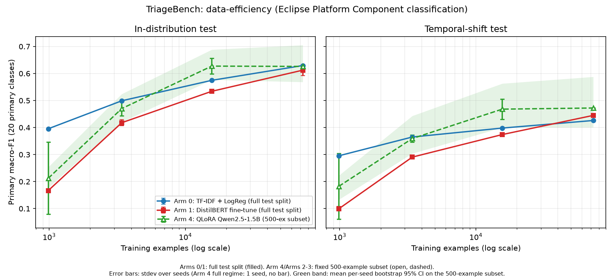

# TriageBench

**Data-Efficient Model Selection for Production Technical-Issue Routing**

A controlled, reproducible comparison of model strategies for routing newly
filed technical issues to the correct software component, run end to end on
one laptop with **$0 of external compute or API spend**. It does not assume
that any model wins; where the evidence cannot separate the options, the
results say so.

## Research question

> For production technical-issue routing, what does the evidence say about the
> trade-off between classical ML, a fine-tuned encoder, a prompted small LLM,
> a fine-tuned small LLM, and (had it been available) a frontier API model, once
> labelled-data volume, latency, temporal drift and cost are taken into account?

## Dataset

Eclipse **Platform** issue reports (122,496 issues, 21 Components, filed
2001-10-11 to 2022-04-12) from the
[Eclipse Issue Report Dataset](https://zenodo.org/doi/10.5281/zenodo.15348468)
(Zenodo DOI `10.5281/zenodo.15348468`, v1.0.1, CC-BY-SA-4.0). The raw data is not
redistributed here; `scripts/download_dataset.py` and `scripts/prepare_data.py`
fetch and verify it (checksum-pinned in `configs/dataset.yaml`). See
[docs/DATASET_CARD.md](docs/DATASET_CARD.md) for provenance and measured
statistics.

**Task:** single-label Component classification from the issue's `Summary` +
`Description`. **Target:** the *current/settled* Component, not the filer's
original routing choice; 17.81% of issues have an unstable label, so part of
every model's error is not recoverable from filing-time text
([docs/METHODOLOGY.md](docs/METHODOLOGY.md)).

## Leakage controls

- Models see filing-time text only (feature allowlist enforced by
  `tests/test_feature_allowlist.py`); status, resolution, history and comments
  are never inputs, and never appear in error-analysis examples.
- Exact-duplicate text groups are kept within one split.
- The temporal boundary, split ratios, long-tail policy and feature allowlist
  were frozen before any model result existed and never changed afterwards (each
  value was introduced in a single commit; all 50 result files carry identical
  split metadata). The one evaluation-code fix after first use was a bug in the
  Arm 0 bootstrap-interval metric (unfiltered instead of primary macro-F1),
  found and corrected during Arm 0 and documented in the experiment log; the
  affected results were recomputed.

## Temporal evaluation

Issues before 2015-01-01 are split 70/15/15 into train / validation /
**in-distribution (ID) test**; every issue from 2015-01-01 onward (18,590) is the
**temporal-shift test**, never seen in training.

## Long-tail policy

Primary macro-F1 averages the 20 classes with at least 50 training examples.
The one rare class (`Incubator`) is reported separately and counted in
micro-F1 and confusion matrices, never merged or silently dropped
(`src/triagebench/evaluation/long_tail_policy.py`).

## Model arms

| Arm | Model | Notes |
|---|---|---|
| 0 | TF-IDF + logistic regression | scikit-learn, CPU |
| 1 | DistilBERT-base-uncased fine-tune | 3 seeds; **substitute for the originally planned ModernBERT-base**, which was too slow on the local hardware under the $0 constraint |
| 2 | Qwen2.5-1.5B-Instruct (4-bit), frozen, naive prompt | 500-example subset |
| 3 | Same model, engineered prompt with the class list | 500-example subset |
| 4 | QLoRA fine-tune of the same model (MLX) | 500-example subset; 3 seeds at 50/200/1000 per class, **1 seed at full data** |
| 5 | Frontier API reference | **Not evaluated** (no credentials; $0 API budget) |

**Data-efficiency regimes:** 50, 200 and 1000 labelled examples per class, and
the full training split (72,736).

## Key findings

Primary macro-F1 (20 primary classes), full training data:

| Arm | ID test | Temporal-shift test | Evaluated on |
|---|---:|---:|---|
| 0 TF-IDF + LogReg | 0.6295 | 0.4261 | full test splits |
| 1 DistilBERT (3 seeds) | 0.6123 ± 0.0203 | 0.4449 | full test splits |
| 2 LLM, naive prompt | 0.1284 | 0.2247 | 500-example subset |
| 3 LLM, engineered prompt | 0.1664 | 0.1996 | 500-example subset |
| 4 QLoRA (1 seed) | 0.6262 (95% CI [0.569, 0.705]) | 0.4723 (CI [0.401, 0.588]) | 500-example subset |

- With enough labels, Arms 0, 1 and 4 have statistically indistinguishable
  in-distribution accuracy; prompting alone (Arms 2/3) is far worse.
- Every trained arm loses 0.15-0.20 macro-F1 under temporal shift, and
  Arm 4's temporal interval contains the Arm 0 and Arm 1 estimates: no ranking
  is established.
- Data efficiency differs most: TF-IDF leads at 50 per class; the QLoRA arm is
  above Arms 0/1 at 1000 per class (0.627 ± 0.029) but by margins comparable to
  its subset confidence interval, and it plateaus beyond that.
- QLoRA fine-tuning was seed-fragile at 50 per class (one of three seeds
  collapsed to predicting one class).
- Cost, measured on one Apple M5 laptop: TF-IDF trains in about 51 s and serves
  at 0.21 ms per request; the QLoRA arm needs an estimated 11.9 h of active
  training and 218 ms (p95 305 ms) per request, unbatched, with 4.4 GB peak
  training memory.

**No arm is declared best.** Whether a costlier model is justified depends on
requirements these experiments do not fix. See
[docs/CONCLUSION.md](docs/CONCLUSION.md),
[docs/RESULTS.md](docs/RESULTS.md),
[docs/PRODUCTION_ANALYSIS.md](docs/PRODUCTION_ANALYSIS.md) and
[docs/ERROR_ANALYSIS.md](docs/ERROR_ANALYSIS.md).



## Limitations

- **Subset vs. full-test evaluation:** Arms 2-4 use a fixed 500-example subset;
  Arms 0/1 use the full test splits. Their estimates are not equal-precision.
- **Arm 4 full data has one seed**; Arm 4's Incubator behaviour is unmeasured
  (Incubator is absent from its subsets).
- **Arm 5 (frontier API) is unavailable**; there is no large-model reference.
- **Encoder substitution:** Arm 1 is DistilBERT, not ModernBERT.
- **Timing** is from a single laptop; several training wall-clock figures are
  inflated by macOS sleep (documented and corrected in the experiment log), and
  one Arm 4 run was lost to an unexplained reboot and rerun unchanged.
- Eclipse Platform only; label noise is substantial.

Full list: [docs/LIMITATIONS.md](docs/LIMITATIONS.md). Every run, including
failures and corrected diagnoses, is in
[docs/EXPERIMENT_LOG.md](docs/EXPERIMENT_LOG.md); design rationale is in
[docs/DESIGN_DECISIONS.md](docs/DESIGN_DECISIONS.md).

## Reproducing

Requires Python >= 3.11 and [uv](https://github.com/astral-sh/uv). Arms 1-4 were
run on Apple Silicon (PyTorch MPS for Arm 1, MLX for Arms 2-4); the MLX arms are
macOS-only. Expect roughly 15 GB of disk for the raw Platform CSV, and many hours
for the full sweep (Arm 4 at full data is about 12 h of active compute).

```bash
# setup
uv venv
uv pip install -e ".[dev,encoder,llm,plots]"
make test lint

# data (checksum-verified; streams only the Platform member of the archive)
make inspect-sample                      # validate parsing on the small sample first
make inspect-full                        # extracts Platform CSV, writes reports/phase1_platform.json
uv run python scripts/prepare_model_data.py \
    --input data/raw/platform_full.csv --output data/processed/platform_model_ready.jsonl
uv run python scripts/build_splits.py    # frozen temporal split -> reports/results/splits/

# model arms (each writes JSON under reports/results/armN/)
uv run python scripts/train_baseline.py                       # Arm 0
uv run python scripts/train_encoder.py                        # Arm 1 (--regime/--seeds to subset)
uv run python scripts/evaluate_llm.py                         # Arms 2 and 3
uv run python scripts/train_lora.py --regime 50 --seeds 0     # Arm 4 training (adapters -> data/checkpoints/, untracked)
uv run python scripts/evaluate_lora.py \
    --adapter-path data/checkpoints/arm4/regime_50_seed0 --regime 50 --seed 0

# aggregation, analysis, plots
uv run python scripts/aggregate_results.py                    # -> reports/results/data_efficiency/summary.json
uv run python scripts/build_production_table.py               # -> reports/results/production/
uv run python scripts/error_analysis_arm4.py \
    --adapter-path data/checkpoints/arm4/regime_full_seed0 --regime full --seed 0
uv run python scripts/generate_plots.py                       # -> reports/results/plots/
```

All committed result files under `reports/results/` are the artifacts behind
every number quoted in the docs; nothing is typed in by hand. Model checkpoints
and the raw/processed dataset are not tracked.

## Repository layout

`src/triagebench/` library code (data parsing, splitting, evaluation, models) ·
`scripts/` entry points above · `configs/` frozen experiment configuration ·
`tests/` unit tests (134 pass; one CUDA test skips on this machine) ·
`docs/` methodology, results, analysis, decisions, log · `reports/` measured
results.

## License

Code: MIT ([LICENSE](LICENSE)). Dataset: CC-BY-SA-4.0, not redistributed here;
see [docs/DATASET_CARD.md](docs/DATASET_CARD.md).
