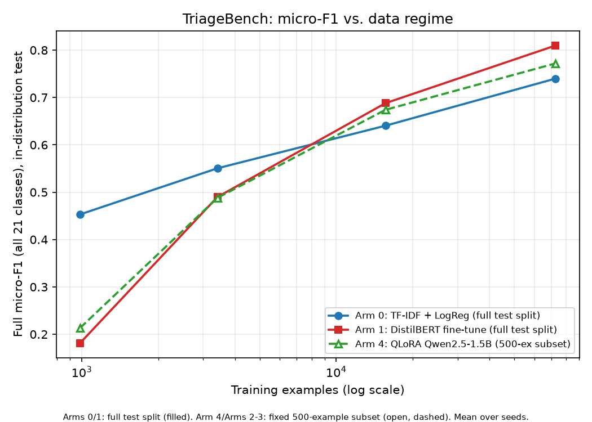

# Results

Status: **final for v1.0.0.** Arms 0-4 complete; Arm 5 (frontier API) not evaluated (no credentials; $0 API budget). Every
number below is read directly from `reports/results/*.json` (via
`scripts/aggregate_results.py` for the data-efficiency table) -- nothing
here is typed in ahead of the corresponding experiment. See
`docs/EXPERIMENT_LOG.md` for the full narrative including failures and
corrections, and `docs/DATASET_CARD.md` for dataset measurements.

## Final synthesis (v1.0.0)

No arm is declared best. The table is the headline evidence, with the
evaluation sets kept explicit. "ID" = in-distribution test split (older era,
same period as training); "temporal" = temporal-shift test split (issues filed
from 2015-01-01 onward, never seen in training). Metric: primary macro-F1 over
the 20 primary classes (Incubator excluded by the frozen long-tail policy).

| Arm | Model | Full-data primary macro-F1 ID | Full-data primary macro-F1 temporal | Evaluated on |
|---|---|---:|---:|---|
| 0 | TF-IDF + Logistic Regression | 0.6295 | 0.4261 | full test splits |
| 1 | DistilBERT-base fine-tune (3 seeds) | 0.6123 ± 0.0203 | 0.4449 | full test splits |
| 2 | Qwen2.5-1.5B 4-bit, naive prompt | 0.1284 | 0.2247 | 500-example subset |
| 3 | Same, engineered prompt with class list | 0.1664 | 0.1996 | 500-example subset |
| 4 | QLoRA fine-tune of the same base (1 seed at full) | 0.6262 | 0.4723 | 500-example subset |
| 5 | Frontier API reference | **not evaluated** | **not evaluated** | -- |

Arm 4 details: ID 95% bootstrap interval [0.569, 0.705], temporal interval
[0.401, 0.588]; micro-F1 0.772 ID / 0.690 temporal; 0 of 500 outputs
unparseable on both splits; 218 ms median and 305 ms p95 single-request
generation latency and 4.4 GB peak training memory on the local Apple M5
(`docs/PRODUCTION_ANALYSIS.md`). At 1000 examples per class Arm 4 scored
0.6273 ± 0.0292 ID (3 seeds), essentially the same as at full data
(0.6262): it plateaus.

### Interpretation

1. **Given enough labels, three quite different approaches reach similar ID
   accuracy.** At full data, Arms 0, 1 and 4 have primary macro-F1 between
   0.61 and 0.63 with overlapping intervals; the data do not separate them.
   Arms 2 and 3 (no fine-tuning) are far lower (0.13 and 0.17), so prompting a
   1.5B model alone is not competitive here; fixing the output *format* (unparseable
   62.6% -> 7.4%) did not fix accuracy.
2. **Under temporal shift every arm degrades, and the ranking is not
   resolved.** Arm 0 falls 0.630 -> 0.426, Arm 1 0.612 -> 0.445, Arm 4
   0.626 -> 0.472. Arm 4's temporal point estimate is the highest, but its
   interval [0.401, 0.588] contains both Arm 0 and Arm 1, so no difference is
   demonstrated. The error analysis (`docs/ERROR_ANALYSIS.md`, Arm 4 only)
   shows shift is largely a change in class mix: IDE grows from 2.5% of
   training data to 10.3% of the temporal split and is almost never recovered
   by Arm 4 (recall 0.05).
3. **Data efficiency is where the arms differ most.** At 50 per class TF-IDF
   leads (0.396 vs. 0.167 for DistilBERT and 0.212 ± 0.133 for Arm 4, where one
   of three seeds collapsed to predicting "Doc"). At 200 per class Arm 4
   (0.470) is near Arm 0 (0.499) and above Arm 1 (0.418). At 1000 per class Arm
   4's estimate (0.627 ± 0.029) is above Arm 0 (0.575) and Arm 1 (0.534) on all
   three seeds, but the margins are comparable to the 500-example subset's
   confidence interval half-width (~0.06), so the size of the advantage is
   uncertain. Beyond 1000 per class Arm 4 stops improving while Arms 0 and 1
   keep improving and catch up.
4. **Arm 4's reliability risk is real at small data.** Seed variance was 0.133
   at 50 per class against 0.008 for Arm 1, due to one collapsed adapter; it
   was 0.027-0.029 at 200 and 1000 per class. Any team fine-tuning a small LLM
   on a few dozen examples per class would need to validate each run.
5. **Cost differs by orders of magnitude and is measured, not assumed.**
   On this laptop Arm 0 needs about 51 s to train and 0.21 ms per request; Arm 4
   needs an estimated 11.9 h of active compute at full data (24.4 h wall-clock,
   sleep-inflated) and 218 ms per request unbatched.

### Limitations that bound these conclusions

- **Evaluation-set comparability.** Arms 2-4 use a fixed 500-example random
  subset of each test split; Arms 0-1 use the full splits (15,585 ID and
  18,590 temporal examples). Point estimates from the two are placed side by
  side in the tables but are not equal-precision measurements. Arms 0/1
  predictions were not stored, so no paired significance test exists.
- **One seed for Arm 4 at full data** (a pre-committed compute limit), so no
  seed-variance estimate exists for the regime where Arm 4 is compared with
  Arms 0/1 at their best.
- **Subset composition.** Incubator (the one rare class) is absent from both
  subsets, so **Arm 4's Incubator behaviour is not measured**; three primary
  classes are absent from the ID subset and two from the temporal subset.
- **Arm 5 (frontier API) is unavailable**: no credentials, and the project
  budget for external compute and paid APIs is $0. No result for it exists
  and none is inferred; the upper-bound reference the original design called for
  is missing.
- **Encoder substitution.** Arm 1 is DistilBERT-base-uncased. The originally
  planned encoder, ModernBERT-base, was superseded because it was too slow on
  the local hardware under the $0 constraint; no ModernBERT result is reported
  (`docs/DESIGN_DECISIONS.md`). Arm 1 should not be read as representing the
  strongest possible encoder.
- **Single-machine measurements.** All timings are from one Apple M5 laptop;
  several training wall-clock figures are inflated by macOS sleep, and one
  Arm 4 full-regime attempt was lost to an unexplained reboot and rerun
  (`docs/EXPERIMENT_LOG.md`, EXP-005/EXP-007).
- **Label noise.** The target is the settled Component, and 17.81% of issues
  have an unstable label (`docs/DATASET_CARD.md`); part of every arm's error is
  not recoverable from filing-time text.
- **Scope.** Eclipse Platform issues only; no cross-product transfer.

The final scientific conclusion is in `docs/CONCLUSION.md`.

## Data-efficiency results (Arm 0 vs. Arm 1)

Source: `reports/results/data_efficiency/summary.json`, generated from
`reports/results/arm0/*.json` and `reports/results/arm1/*.json`.

**Arm 0**: TF-IDF + Logistic Regression, deterministic (1 run per regime).
**Arm 1**: DistilBERT-base-uncased fine-tuned, 3 epochs, MPS, 3 seeds per
regime (mean ± population stdev shown).

### Primary macro-F1 (20 primary classes; Incubator excluded per the frozen long-tail policy)

| Regime | n_train | Arm 0 (test-ID) | Arm 1 (test-ID) | Arm 0 (temporal-shift) | Arm 1 (temporal-shift) |
|---|---:|---:|---:|---:|---:|
| 50/class | 985 | 0.3955 | 0.1668 ± 0.0079 | 0.2954 | 0.0993 ± 0.0086 |
| 200/class | 3,412 | 0.4990 | 0.4179 ± 0.0109 | 0.3649 | 0.2906 ± 0.0012 |
| 1000/class | 15,614 | 0.5747 | 0.5341 ± 0.0040 | 0.3980 | 0.3740 ± 0.0023 |
| full | 72,736 | 0.6295 | 0.6123 ± 0.0203 | 0.4261 | 0.4449 ± 0.0031 |

Full-regime bootstrap 95% CIs for primary macro-F1 (test-ID): Arm 0
[0.593, 0.657], Arm 1 seed 0 [0.600, 0.647] -- **substantially
overlapping, statistically indistinguishable** at full data on this
metric.

### Full micro-F1 (all 21 classes; test-ID)

| Regime | Arm 0 | Arm 1 (mean) |
|---|---:|---:|
| 50/class | 0.4531 | 0.1815 |
| 200/class | 0.5505 | 0.4898 |
| 1000/class | 0.6404 | 0.6880 |
| full | 0.7399 | 0.8097 |

### Findings (no model forced to win)

- **TF-IDF+LogReg leads on in-distribution primary macro-F1 at every
  tested regime**, though the gap narrows steadily as training data
  grows (0.229 at 50/class -> 0.017 at full, and the full-regime gap is
  within bootstrap noise).
- **A genuine crossover exists**, but only on two of the four metrics:
  DistilBERT overtakes TF-IDF on full micro-F1 somewhere between the
  1000/class and full regimes, and on temporal-shift primary macro-F1
  at the full regime (0.445 vs. 0.426) -- the encoder generalizes
  slightly better to the held-out recent era once given enough data,
  despite trailing on the in-distribution headline metric.
- **Every arm degrades substantially under temporal shift**: Arm 0 drops
  0.204 (0.630 -> 0.426); Arm 1 drops 0.167 (0.612 -> 0.445) at full
  data. Robustness to temporal drift is a real, shared limitation, not
  specific to either approach.
- **Seed variance for Arm 1 is regime-dependent**, not uniformly small:
  stdev 0.004-0.011 at 50/200/1000/class, but 0.020 at full data (see
  `docs/EXPERIMENT_LOG.md` EXP-005) -- a single-seed full-regime
  estimate would have been noticeably less reliable than at smaller
  regimes.
- **Latency**: Arm 0 (scikit-learn, Apple M5 CPU) p50 0.186ms / p95
  0.288ms, ~22,000 req/s batched. Arm 1 (DistilBERT, Apple M5 MPS) p50
  ~7ms / p95 ~10-64ms (varies by regime's tokenizer warm state),
  ~11,000 req/s batched. See individual result files for exact
  per-regime figures; M5 numbers are not compared against any NVIDIA
  measurement (none exists -- Arm 1 ran entirely on local $0 compute).

## Arm 2/3: small LLM base vs. prompted (paired 500-example subset)

Source: `reports/results/arm2/*.json`, `reports/results/arm3/*.json`.
Model: `mlx-community/Qwen2.5-1.5B-Instruct-4bit` (Apache-2.0 base
license), via `mlx-lm` on Apple M5, $0 cost. Evaluated on a fixed,
uniform-random 500-example subset of each frozen test split (not the
full set -- generation is far slower per example than the
classifier-head arms; see `configs/experiments.yaml` `llm_arms` for the
pre-registered subset methodology). **Lower statistical power than the
full-test-set Arm 0/1 results above.**

| Arm | Split | primary macro-F1 | full micro-F1 | unparseable rate |
|---|---|---:|---:|---:|
| Arm 2 (naive prompt, no class list) | test-ID | 0.1284 | 0.1660 | 62.6% |
| Arm 2 (naive prompt, no class list) | test-shift | 0.2247 | 0.1880 | 68.0% |
| Arm 3 (engineered prompt, full class list) | test-ID | 0.1664 | 0.2040 | 7.4% |
| Arm 3 (engineered prompt, full class list) | test-shift | 0.1996 | 0.2680 | 6.4% |

**Findings**: giving the model the 21-class vocabulary (Arm 3) collapses
the unparseable/hallucinated-output rate from ~62-68% down to ~6-7%, but
only modestly moves primary macro-F1 -- fixing output *format* is not
the same as fixing classification *accuracy*. **Both LLM arms
substantially underperform Arm 0 even at its smallest (50/class) data
regime** (0.396 test-ID) and Arm 1's smallest regime (0.167 test-ID):
on this task, zero-shot prompting with a small (1.5B) model does not
outperform classical ML given even minimal supervision. This is a real,
evidence-based answer to one of the project's central questions, not
assumed in either direction ahead of time.

## Arm 4: QLoRA fine-tune of the same small LLM (complete)

Source: `reports/results/arm4/*.json`. Model: same base as Arms 2/3
(`mlx-community/Qwen2.5-1.5B-Instruct-4bit`), LoRA adapters (rank 8, all
28 layers) trained via `mlx-lm`'s native QLoRA support on Apple M5, $0
cost. Evaluated on the SAME fixed 500-example paired subset as Arms
2/3, using the same engineered prompt template used for training.
**Status: complete. Regimes 50/200/1000 per class have 3 seeds each; the
full regime has seed 0 only** (pre-committed on compute grounds in
`docs/EXPERIMENT_LOG.md` EXP-007, before any Arm 4 result existed --
one full-regime seed is ~14-16h of active compute on this laptop).
Full-regime seed 0 first ran to iteration 10,896 and was lost to an
unexplained reboot (logged in EXP-007), then was rerun unchanged. Some
Arm 4 `train_seconds` values (e.g. full regime: 87,683.9s wall-clock)
include macOS sleep wall-clock inflation from long unattended local
runs (`caffeinate -i` does not prevent lid-closed sleep); training
correctness is unaffected, but those values are not compute cost.

| Regime | n_train | primary macro-F1 (test-ID) | primary macro-F1 (test-shift) |
|---|---:|---:|---:|
| 50/class (3 seeds) | 985 | 0.2123 ± 0.1333 | 0.1824 ± 0.1217 |
| 200/class (3 seeds) | 3,412 | 0.4703 ± 0.0267 | 0.3593 ± 0.0127 |
| 1000/class (3 seeds) | 15,614 | 0.6273 ± 0.0292 | 0.4680 ± 0.0375 |
| full (seed 0 only) | 72,736 | 0.6262 | 0.4723 |

Per-seed detail (50/class): seed 0 = 0.2968 / 0.2599, seed 1 = 0.3161 /
0.2768, **seed 2 = 0.0241 / 0.0106 (a genuine LoRA mode collapse -- the
adapter predicted "Doc" for 37/40 sampled examples regardless of true
label; see EXP-007 for the full diagnosis)**. Per-seed detail
(200/class, no collapse in any seed): seed 0 = 0.4326 / 0.3447, seed 1
= 0.4913 / 0.3578, seed 2 = 0.4869 / 0.3756. Per-seed detail
(1000/class, no collapse in any seed): seed 0 = 0.6568 / 0.4281, seed 1
= 0.6375 / 0.5182, seed 2 = 0.5875 / 0.4579. Full regime seed 0 =
0.6262 / 0.4723.

**Findings**:
- At 50/class, QLoRA fine-tuning substantially outperforms both
  prompting the same frozen base model (Arm 3: 0.1664 / 0.1996) and
  fine-tuning DistilBERT at the same regime (Arm 1: 0.1668 ± 0.0079 /
  0.0993 ± 0.0086) -- on the two seeds that trained normally. It still
  trails classical TF-IDF+LogReg (Arm 0: 0.3955 / 0.2954) at this tiny
  regime.
- **Seed variance at 50/class is dramatically higher than any other
  arm measured so far** (stdev 0.1333 vs. Arm 1's 0.0079 at the same
  regime) -- driven entirely by one seed's mode collapse, not gradual
  spread. A team adopting this strategy in production would need to
  validate each fine-tuning run before deploying it, not assume any
  single run is representative -- a real, production-relevant risk
  this multi-seed protocol surfaced that a single-seed pilot would
  have missed entirely (in either direction: a single lucky or
  unlucky seed).
- **At 200/class, the collapse does not recur** (stdev back down to
  0.0267, comparable to Arm 1's 0.0109) and **Arm 4 nearly closes the
  gap to Arm 0** (0.4703 vs. 0.4990) while clearly overtaking Arm 1
  (+0.052) -- the unparseable rate also drops to essentially zero
  (0-1/500, vs. 5-14% at 50/class). Fine-tuning quality and stability
  both improve quickly with more data at this model/method
  combination.
- **At 1000/class, Arm 4's point estimates are above Arm 0's and Arm 1's
  on both splits, on every seed** (0.6273 ± 0.0292 test-ID, 0.4680 ± 0.0375
  test-shift vs. Arm 0's 0.5747/0.3980 and Arm 1's 0.5341 ± 0.0040 /
  0.3740 ± 0.0023), with 0% unparseable throughout. **Subset-noise caveat:**
  Arm 4 is scored on a 500-example subset (per-seed bootstrap 95% CIs about
  ±0.06 wide on each side of the estimate), while Arms 0/1 are scored on the
  full test split; the ID gaps (0.053 over Arm 0, 0.093 over Arm 1) are of the
  same order as that interval. The consistency across three seeds makes a
  pure fluke unlikely, but the size of any real advantage at this regime is
  not pinned down, and no significance test on paired examples was run
  (Arms 0/1 predictions were not stored). Seed variance is back to a normal
  range (comparable to 200/class), so regime 50's collapse was a
  minimal-data tail risk rather than a recurring instability.

- **At the full regime, Arm 4 plateaus**: 0.6262 test-ID / 0.4723
  test-shift (seed 0), essentially unchanged from 1000/class
  (0.6273 / 0.4680) despite 4.7x more training data. Bootstrap 95% CIs
  (500-example subset): test-ID primary macro-F1 [0.569, 0.705],
  test-shift [0.401, 0.588]; full micro-F1 0.772 [0.738, 0.810] and
  0.690 [0.648, 0.730]; 0/500 unparseable on both splits.

### Full-regime comparison, Arms 0-4 (no winner forced)

| Arm | eval set | primary macro-F1 test-ID | primary macro-F1 test-shift | micro-F1 test-ID |
|---|---|---:|---:|---:|
| Arm 0 TF-IDF+LogReg (full data) | full test split | 0.6295 [0.593, 0.657] | 0.4261 | 0.7399 |
| Arm 1 DistilBERT (full data, 3 seeds) | full test split | 0.6123 ± 0.0203 | 0.4449 ± 0.0031 | 0.8097 |
| Arm 2 naive prompt (no training) | 500-ex subset | 0.1284 | 0.2247 | 0.1660 |
| Arm 3 engineered prompt (no training) | 500-ex subset | 0.1664 | 0.1996 | 0.2040 |
| Arm 4 QLoRA (full data, seed 0) | 500-ex subset | 0.6262 [0.569, 0.705] | 0.4723 [0.401, 0.588] | 0.772 |

  - **On test-ID primary macro-F1, Arms 0, 1 and 4 are statistically
    indistinguishable at full data** (0.6295 / 0.6123 / 0.6262, with
    Arm 4's interval overlapping both). Arm 4's full-data test-shift
    point estimate (0.4723) is the highest of the three, but its CI
    overlaps Arms 0 and 1, so this is not a demonstrated difference.
  - On full micro-F1 the ordering of point estimates is Arm 1 (0.8097) > Arm 4 (0.772) >
    Arm 0 (0.7399); Arm 4's micro-F1 CI [0.738, 0.810] contains both
    other values.
  - Arms 2 and 3 (no fine-tuning) are far below every trained arm.
  - **Comparison caveat**: Arm 4 (and Arms 2/3) are scored on the fixed
    500-example subset; Arms 0/1 on the full test split. Arm 4's
    single full-regime seed also carries no seed-variance estimate.
    The earlier 1000/class advantage (Arm 4 above Arms 0/1 on all 3
    seeds) should be read with the same subset-noise caveat: the gaps
    there (~0.05) are comparable to the subset's CI half-width (~0.06).
  - **Data-efficiency conclusion supported by the evidence**: Arm 4 is
    unreliable at 50/class (one collapsed seed), roughly at parity with
    Arm 0 by 200/class, and at or above Arms 0/1 at 1000/class, after
    which extra data adds nothing measurable for Arm 4 while Arms 0/1
    keep improving and converge to it. No arm is shown to win at full
    data.
  - **Cost/latency**: Arm 4 generation p50 218ms / p95 305ms per
    example (test-ID, M5 MPS), versus sub-millisecond Arm 0 and ~7ms
    Arm 1; peak training memory 4.4GB. Arm 4 full-data training was
    ~14-16h of active compute versus ~2h for Arm 1 and minutes for
    Arm 0 (wall-clock 24.4h, inflated by sleep).
  - **Incubator (rare class)**: `rare_class_metrics` is empty for Arm 4
    because Incubator does not appear in either 500-example subset, so
    Arm 4's rare-class behavior is NOT MEASURED (Arm 0's full-test
    rare-class figures are in `reports/results/arm0/`). The subset also
    lacks PMC/Scripting/Website (test-ID) and Update/WebDAV
    (test-shift), so primary macro-F1 averages over the remaining
    primary classes.

## Not done / not measurable (explicit)

- **Arm 5** (frontier API reference): not evaluated. No API credentials were
  available and the project's external-compute/API budget is $0 (see
  `docs/EXPERIMENT_LOG.md`). No result for it exists and none is inferred.
- **Cross-arm error analysis** (per-class metrics and disagreement analysis for
  Arms 0/1): not measurable, because predictions and trained models were not
  stored and retraining is out of scope. Arm 4's error analysis is in
  `docs/ERROR_ANALYSIS.md`.
- **Arm 4 rare-class (Incubator) behaviour**: not measured (absent from the
  500-example subsets).
- **Inference memory, energy, batched/server LLM serving**: not measured
  (`docs/PRODUCTION_ANALYSIS.md`).
